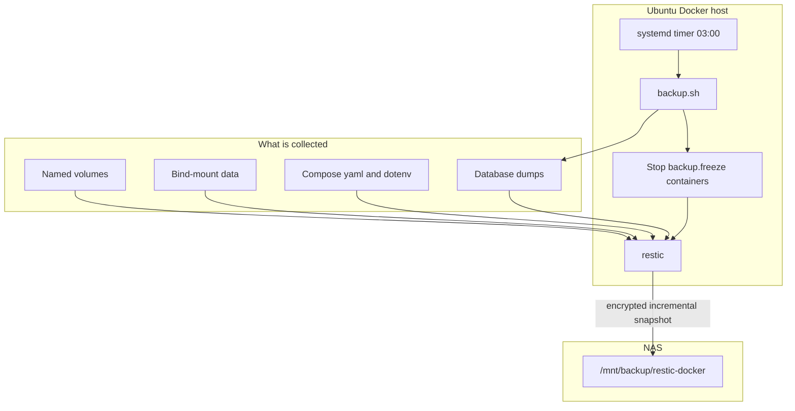

# Docker host backup

Encrypted, incremental backups of Docker data on an Ubuntu host to a LAN NAS. [restic](https://restic.net/) stores the snapshots; this repo is the host glue — mount check, database dumps, freeze labels, a systemd timer, and a restore helper.

Back up **data**, not the Docker engine. Recreate stacks from compose and registry pulls. Do not snapshot `/var/lib/docker` wholesale or Docker images.



## What is backed up

- Named volumes: `/var/lib/docker/volumes/<name>/_data`
- Bind-mount paths in `BACKUP_BIND_PATHS`
- Compose project dirs in `BACKUP_COMPOSE_PATHS` (yaml + `.env`)
- Dumps under `/var/backups/docker-dumps/<container>/`

Excluded: `overlay2`, image layers, build cache, container writable layers.

## Consistency

| Data | Method |
|---|---|
| Postgres / MySQL / MariaDB / Mongo | `docker exec` dump, then restic the dump dir |
| Redis | `redis-cli --rdb` (or equivalent) into the dump dir |
| SQLite / single-file DBs | Label `backup.freeze=true` — stop, snapshot, start |
| Media / config | Hot copy while running |

Map containers in `/etc/docker-backup/dumps.yaml` or set label `backup.dump=postgres` (or `mysql`, `mariadb`, `mongo`, `redis`). Unmapped database containers are **not** treated as consistent; the script warns.

## Install

On the Ubuntu Docker host:

1. Mount the NAS at `/mnt/backup` (CIFS shown; NFS also works):

   ```fstab
   //NAS_IP/share  /mnt/backup  cifs  credentials=/root/.backup-nas-credentials,uid=0,gid=0,file_mode=0600,dir_mode=0700,_netdev,x-systemd.automount  0  0
   ```

   `/root/.backup-nas-credentials`:

   ```
   username=backup
   password=...
   ```

   `chmod 600 /root/.backup-nas-credentials`

2. Copy this repo to the host and run:

   ```bash
   sudo ./scripts/install.sh
   ```

3. Edit `/etc/docker-backup/backup.env` and `/etc/docker-backup/dumps.yaml`.
4. Save the restic password (`/root/.restic-password`) somewhere offline. Without it, snapshots are unreadable.
5. First run: `sudo systemctl start docker-backup.service`
6. Enable the 03:00 timer: `sudo systemctl enable --now docker-backup.timer`
7. Restore-test one small volume after the first success.

`install.sh` installs restic, writes units, and generates a restic password if missing. It does **not** write NAS credentials.

## Daily job

systemd timer at 03:00 local (`Persistent=true`). Retention: 7 daily / 4 weekly / 6 monthly, then prune. Overlapping runs are blocked with `flock`. If the NAS is unmounted, the unit fails.

Optional: set `HEALTHCHECKS_URL` to a Healthchecks.io ping URL.

## Restore

```bash
sudo docker-restore snapshots
sudo docker-restore restore --include /var/lib/docker/volumes/mydata/_data --target /tmp/restore
# inject into a named volume (stack must be stopped):
sudo docker-restore volume --volume mydata
```

Then:

1. Recreate the compose project (or restore compose files from the snapshot).
2. Stop the stack.
3. Copy restored files into the volume/bind path, or `pg_restore` / `mysql` / `mongorestore` from the dump.
4. Start the stack and verify.

Postgres custom-format dumps: `pg_restore -d DB file.dump`. `pg_dumpall` SQL: `psql -f file.sql`.


## Secrets (never commit)

- `/root/.restic-password` (mode 600)
- `/root/.backup-nas-credentials` (mode 600)
- Filled-in `backup.env` on the host

## Layout

- `config/backup.env.example`
- `config/dumps.yaml.example`
- `config/fstab.snippet`
- `scripts/common.sh`, `scripts/parse_dumps.py`
- `scripts/backup.sh` — mount check, dumps, freeze, restic, forget/prune
- `scripts/restore.sh` — list / restore / volume inject
- `scripts/install.sh`
- `systemd/docker-backup.service`, `docker-backup.timer`, `docker-backup-notify.service`
